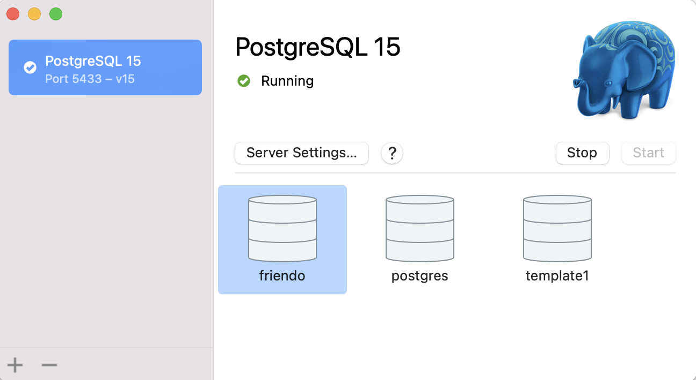
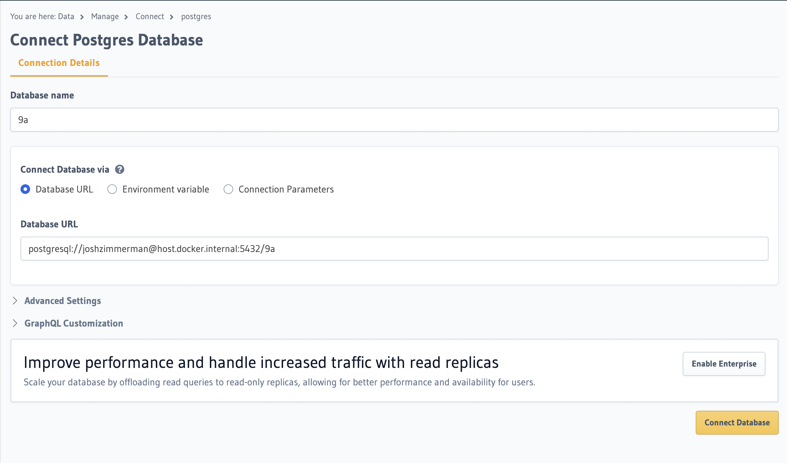
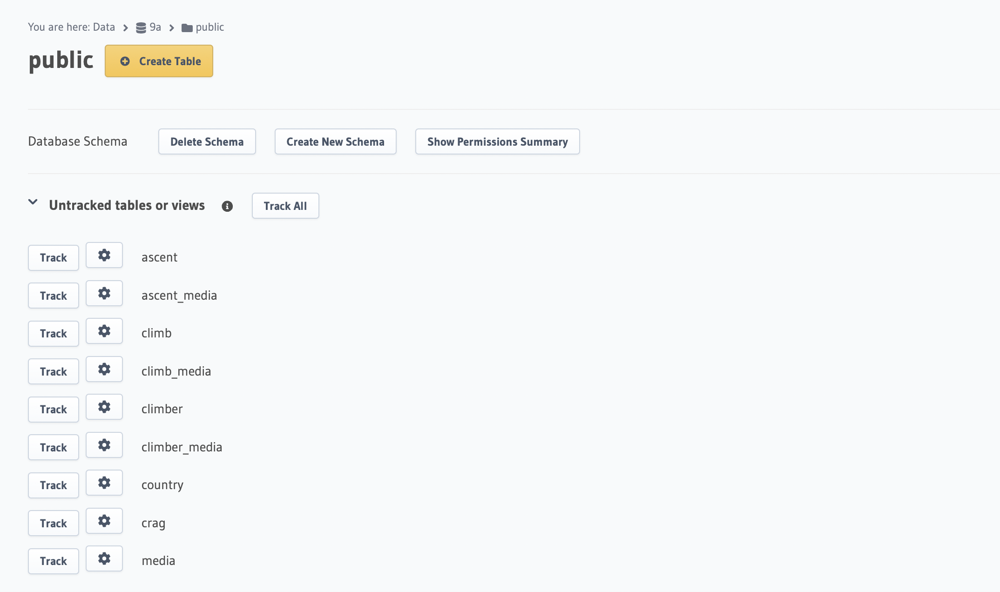

# 9a-database

Database of every climb graded 9a or harder

<h3>Setup</h3>
Requirements:

- PostgreSQL
- Docker (+ Docker Compose version 2.0 or higher)

<h4>Step 1: Load database from backup</h4>

1.  In the Postgres desktop client, initialize and/or start your server.
    
2.  Create a new database **9a** by entering the following command in the terminal:

        createdb -T template0 9a

3.  Load backup:

        psql 9a < backups/9a20230828.sql

<h4>Step 2: Create a GraphQL endpoint with Hasura</h4>

1.  Get the Compose file & start the containers by entering the following terminal commands:

    - Get the Compose file:

            curl https://raw.githubusercontent.com/hasura/graphql-engine/stable/install-manifests/docker-compose/docker-compose.yaml -o docker-compose.yml

    - Start the Hasura GraphQL Engine and the Postgres database in Docker containers:

            docker compose up -d

2.  Connect **9a**:

    - Open the Hasura Console by navigating to `http://localhost:8080/console` in your browser. From the Console, click the Data tab.

      

    - Create a new database using `postgresql://[username]@host.docker.internal:5432/9a` as the database URL.

      

    - Add all tables and relationships by clicking "Track All" for tables and relationships.

      

3.  Manually rename the following GraphQL relationships by going to the Relationships tab in each table:

    - climber:
      - country -> home_country
    - media:
      - ascent_media -> media_ascents
      - climb_media -> media_climbers
      - climber_media -> media_climbs
    - ascent_media, climb_media, climber_media:
      - medium -> media
