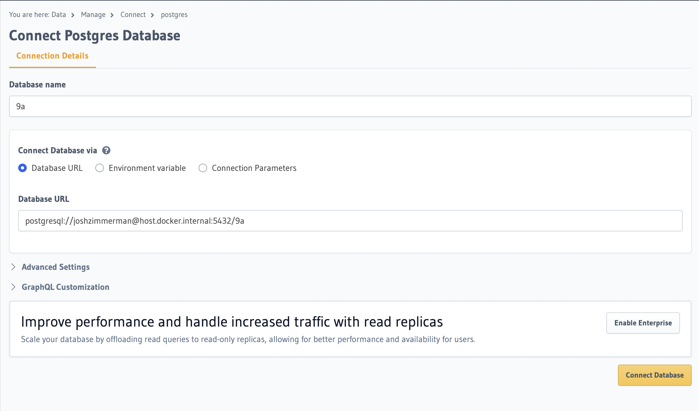

# 9a-database

Database of every climb graded 9a or harder

<h3>Setup</h3>
Requirements:

- PostgreSQL
- Docker (+ Docker Compose version 2.0 or higher)

<h4>Step 1: Load database from backup</h4>

1.  In the Postgres desktop client, initialize and/or start your server.
    
2.  Create a new database **9a** by entering the following command in the terminal:

        createdb -T template0 9a

3.  Load backup:

        psql 9a < backups/9a20230828.sql

<h4>Step 2: Create a GraphQL endpoint with Hasura</h4>

1.  Get the Compose file & start the containers by entering the following terminal commands:

    - Get the Compose file:

            curl https://raw.githubusercontent.com/hasura/graphql-engine/stable/install-manifests/docker-compose/docker-compose.yaml -o docker-compose.yml

    - Start the Hasura GraphQL Engine and the Postgres database in Docker containers:

            docker compose up -d

2.  Connect **9a**:

    - Open the Hasura Console by navigating to `http://localhost:8080/console` in your browser. From the Console, click the Data tab:

      

    - Create a new database using `postgresql://[username]@host.docker.internal:5432/[dbname]` as the database URL

      

3.  Create the following GraphQL relationships:

    - ascent:
      - _climb_: ascent/climb_id -> climb/id
      - _climber_: ascet/climber_id -> climber/id
      - _ascent_media_: ascent/id -> ascent_media -> ascent_id
    - climb:
      - _crag_: climb/crag_id -> crag/id
      - _ascents_: climb/id -> ascent/climb_id
      - _climb_media_: climb/id -> climb_media/climb_id
    - climber:
      - _home_country_: climber/country_id -> country/id
      - _ascents_: climber/id -> ascent/climber_id
      - _climber_media_: climber/id -> climber_media -> climber_id
    - country:
      - _climbers_: country/id -> climber/country_id
      - _crags_: country/id -> crag/country_id
    - crag:
      - _country_: crag/country_id -> country/id
      - _climbs_: crag/id -> climb/crag_id
    - media:
      - _media_ascents_: media/id -> ascent_media/media_id
      - _media_climbers_: media/id -> climber_media/media_id
      - _media_climbs_: media/id -> climb_media/media_id
    - ascent_media:
      - _ascent_: ascent_media/ascent_id -> ascent/id
      - _media_: ascent_media/media_id -> media/id
    - climb_media:
      - _climb_: climb_media/climb_id -> climb/id
      - _media_: climb_media/media_id -> media/id
    - climber_media:
      - _climber_: climber_media/climber_id -> climber/id
      - _media_: climber_media/media_id -> media/id
